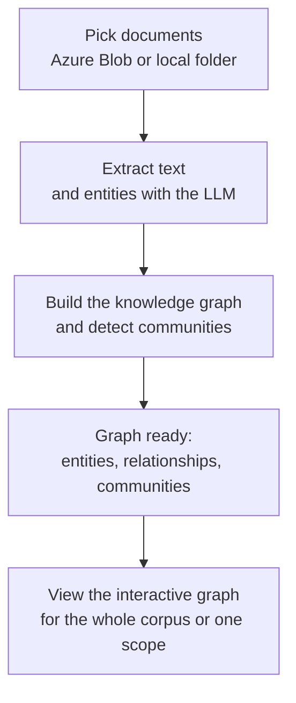
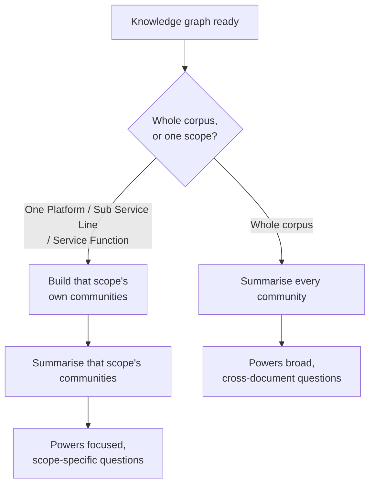
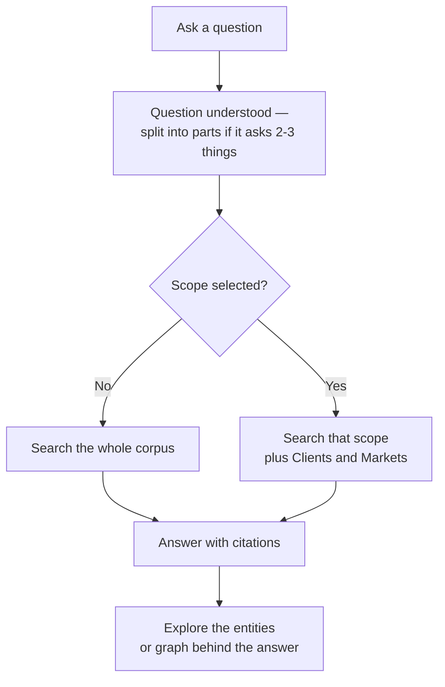
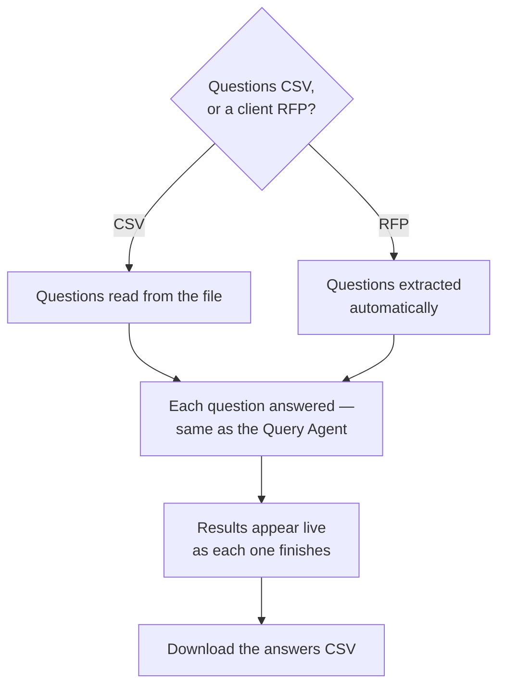

# cosmos-rag — Cosmos DB migration workspace

Clean copy of the RFP GraphRAG app for the Cosmos DB storage migration
(see `../migration_strategy.md`). The parent folder stays untouched as the
working reference version; all migration work happens here.

## Workflow overview

One simple diagram per tab — what you do, in order. (Full technical detail is
in the sections below; these are just the shape of each workflow.)

### 1 · Data Prep



### 2 · Community Summariser



### 3 · Query Agent



### 4 · Batch Q&A



## Migration progress

| Step | Status | What |
|---|---|---|
| 1. GraphStore interface | ✅ done | All entity/relationship/chunk/community/stats reads and writes go through `app/services/graph_store.py`. `FileGraphStore` preserves today's file layout — behaviour unchanged. |
| 2. CosmosGraphStore | ✅ done | Same interface against the five containers. Diff-based `save_extraction` (no O(N²) rewrites), per-doc chunk upserts, map/summaries/stats in `communities` via `kind` field, snapshot export for the D3 generator. `STORAGE_BACKEND=cosmos` is now the active backend. |
| 3. Pipeline write path | ✅ done | Extraction + summariser write per-doc/per-community through the store; chunks pushed via `save_doc_chunks` after text extraction. Local files remain as disposable scratch only. |
| 4. Retriever read path | ✅ done | Every retrieval step is a targeted query: entity candidates via CONTAINS on name/aliases/type, per-hop edge queries (ARRAY_CONTAINS), chunk candidates via CONTAINS on text (TOP-capped), summaries in one projection query, financial table as a single-partition /type query. Query cost scales with matches, not corpus size. |
| 5. Jobs container | ✅ done | Write-through job persistence (throttled to 2 s, forced on status transitions, logs capped at 500, non-JSON LangGraph state stripped) + read-through `status_dict()` fallback — jobs survive restarts and other replicas can answer polls. |
| 6. Backfill + verify | ✅ done | `scripts/backfill_to_cosmos.py` migrated the file artefacts (48 entities, 500 chunks/100 docs, map, summaries, stats); all three tab endpoints verified against Cosmos. |

**Perf note**: individual Cosmos calls take 1–5 s from a local dev machine (cross-region
round trips to East US 2 + client warmup). From the Azure-hosted web app in the same
region these drop to tens of ms. Never call `summary_ok()` in a loop — use
`summary_ok_ids()` (one query); that mistake cost 37 s on 48 communities.

## Feature set (client-test feedback round, 2026-07-29)

Five features shipped from live testing feedback, on top of the four tabs:

| # | Feature | What it does |
|---|---|---|
| 1 | **Shared-password login** | Optional PoC gate. Set `APP_PASSWORD` in `.env` → a correct password mints an HMAC-signed HttpOnly cookie (stdlib only, no extra dependency); a middleware guards every page/API. Empty `APP_PASSWORD` = open (local dev). A "Sign out" pill appears when enabled. Not per-user identity — for real auth, front with App Service Easy Auth (Entra ID). |
| 2 | **Scope spans both metadata fields** | The scope selector is now **"Platform / Sub Service Line / Service Function"** and lists values from **both** the `Platform` field *and* the `Services_Function` field. The two fields never share a value, so a selected value matches whichever field it belongs to (`scoped_doc_ids(any_value=)`). The dropdown groups the two under labelled optgroups. |
| 3 | **RFP upload → live answers** (Tab 4) | Besides a questions CSV, Tab 4 accepts a **client RFP (PDF/DOCX)**: the model extracts every bidder question, then answers each dual-track. Answers **stream into a live-filling table** as they complete (not at the end), the **partial CSV is downloadable mid-run**, and each row records **Model, Time (s), Retrieval Settings** alongside Answer/Status/Sources/citations. |
| 4 | **Per-scope community summaries** | A **separate community graph per scope value** — every Platform / Sub Service Line value *and* every Service Function value — with **no entity re-extraction** (filter existing entities to the scope's docs → Louvain → summarise). Built all-upfront from the Community tab with live progress; each scope's artefacts live in their own `graph_id` partition. |
| 5 | **Per-scope graph visualisation** | The knowledge-graph HTML is generated **on demand, per scope**, and **degree-capped** — the whole-corpus graph (~22.6k nodes) froze D3 and rendered blank. A "Graph scope" picker on the Data Prep tab opens one scope's sub-graph, coloured by that scope's own communities (falls back to global communities when a scope hasn't been built). |
| 6 | **Question decomposition** | The planner call detects when a question genuinely asks 2-3 SEPARATE things and splits it into up to 3 self-contained sub-questions — each retrieved separately (so none starves another of evidence), then answered in ONE synthesis call. Still exactly 2 LLM calls. The answer shows an "Interpreted as N questions" note so you can confirm the split matched your intent. |

## Configuration (.env)

- `APP_PASSWORD` — set to require a shared password before using the app (feature
  #1); `APP_SESSION_HOURS` sets the cookie lifetime (default 12). Empty = open.
- `MAX_SUBQUESTIONS` — cap on question decomposition (default `3`, `0` = no cap;
  see "Question decomposition"). A safety ceiling of 10 always applies.
- `STORAGE_BACKEND=file` — JSON/md files under `DATA_DIR` (local dev / rollback)
- `STORAGE_BACKEND=cosmos` — Azure Cosmos DB (the active production backend)
- `COSMOS_ENDPOINT` / `COSMOS_KEY` / `COSMOS_DATABASE` — PoC account
  `graph-rag-docsync-cosmos` (personal subscription). **Moving to the office
  account later = change only these three values.**

Cosmos containers (already provisioned, shared 1000 RU/s free tier):
`entities(/type)` · `relationships(/source_doc)` · `chunks(/doc_id)`
· `communities(/graph_id)` · `jobs(/id)`

## Backfill (moving data into a Cosmos account)

`scripts/backfill_to_cosmos.py` copies whatever is in the local `data/` folder
(entities, relationships, chunks, community map + summaries, stats) into the
Cosmos account configured in `.env`. It shows the target endpoint and asks for
confirmation before writing, and is idempotent — re-running upserts.

```powershell
cd cosmos-rag
..\.venv\Scripts\python.exe -m scripts.backfill_to_cosmos                # backfill + verify
..\.venv\Scripts\python.exe -m scripts.backfill_to_cosmos --verify-only  # counts only, no writes
..\.venv\Scripts\python.exe -m scripts.backfill_to_cosmos --yes          # skip confirm prompt
```

### Clearing Cosmos (fresh backfill / clean re-extraction)

`scripts/clear_cosmos.py` PERMANENTLY deletes items from the graph containers in
whatever account `.env` points at. Blob documents are untouched — everything in
Cosmos is derived and rebuildable. Shows counts + target endpoint and requires
typing `delete` before touching anything (`--yes` skips for scripted use).

```powershell
..\.venv\Scripts\python.exe -m scripts.clear_cosmos --counts-only        # read-only
..\.venv\Scripts\python.exe -m scripts.clear_cosmos                      # asks confirmation
..\.venv\Scripts\python.exe -m scripts.clear_cosmos --yes                # no prompt
..\.venv\Scripts\python.exe -m scripts.clear_cosmos --containers chunks,jobs
```

Typical fresh start: `clear_cosmos` → run Data Prep (extracts straight into
Cosmos) → Community Summariser. Or `clear_cosmos` → `backfill_to_cosmos` if the
data already exists as local files.

### Removing a single document (no re-extraction)

`scripts/remove_doc.py` evicts document(s) from the graph — entities (shared
entities keep their other sources), relationships, chunks, local scratch — then
rebuilds the graph. Use it when something was ingested that doesn't belong
(e.g. a **client RFP** uploaded into the responses folder: its text matches the
very questions users ask, so it dominates retrieval). Shows an impact preview
and asks for confirmation.

```powershell
..\.venv\Scripts\python.exe -m scripts.remove_doc "clientname_oracle_rfp.docx"
```

Afterwards: delete the file from blob too (or the next full Data Prep run
re-ingests it), and re-run the Community Summariser (Select all — clustering
changed). The scan UI also warns when file names containing "RFP" are about to
be ingested.

**Office-account move checklist:**
1. Create the same five containers in the office Cosmos account
   (shared DB throughput; partition keys as listed above)
2. Point `COSMOS_ENDPOINT` / `COSMOS_KEY` / `COSMOS_DATABASE` in `.env` at it
3. If you have newly extracted file data: run the backfill
4. `--verify-only` to confirm counts, then start the app — done

## Run locally

```powershell
cd cosmos-rag
..\.venv\Scripts\python.exe -m uvicorn app.main:app --port 8002 --reload
```

(Reuses the parent folder's venv; run from inside `cosmos-rag/` so `.env` and
`data/` resolve to this folder.)

## Batch Q&A (Tab 4) — questions in, answers out

Two input modes, one answer pipeline:

- **Questions CSV** — one question per row (column named `Question`, else the
  first column; delimiter/BOM sniffed). Limits: 2 MB, 500 questions.
- **RFP document (PDF/DOCX)** — upload the client RFP and the model extracts the
  bidder questions first, via a **three-stage pipeline** ported from the office
  team's proven extractor (a single-pass prompt matched only ~6/16 of a
  hand-curated golden set):
  1. **Extract** — windowed over the RFP text (~6k chars, small overlap so a
     parent question keeps its sub-bullets); precise rules for what *is* vs
     *isn't* a biddable question, merging sub-bullets into their parent.
  2. **Decompose** — split compound asks ("describe X **and** explain Y") into
     standalone parts, with a strict "each part answerable on its own" test.
  3. **Answerability filter** — tag each question **SEND** (a proposal writer
     could answer it from the response library) or **SUPPRESS** (administrative,
     form/attachment, pointer-only, procurement mechanics, pricing sheets…).
     Suppressed questions are **kept in the output** (marked `FILTERED`, not sent
     to the model — for auditability) so you can confirm nothing real was
     dropped. Two dedup passes bracket the decompose step.

  The preview shows the breakdown ("*N extracted · M answerable · K filtered*")
  and only the answerable questions run. Limit: 25 MB. **The RFP is never
  ingested into the answer corpus** — it is only read for its questions. (It's
  also poison as corpus content: because user questions come *from* it, its text
  out-matches every proposal document. Use `scripts/remove_doc.py` if one was
  ingested by mistake; the scan UI warns on filenames containing "RFP".)

Either way: every question runs the normal planner → retrieve → synthesise
pipeline, and the answers come back as a CSV.

- **Output columns** (appended to your originals): `Answer`, `Status`,
  `Confidence` (0.00-1.00 — how well the retrieved evidence supports the answer)
  and `Confidence Reasoning` (one-line rationale), `Sources` (citations),
  `Matching Documents`, `Content Tracks`, `Query Type`, `Interpreted As`,
  `Sub-Questions` (populated when a row's question was decomposed into 2-3 parts
  — see "Question decomposition" below), `Model`, `Time (s)`,
  `Retrieval Settings`. The results table also shows a **Score** column (the
  Query tab shows the same score as a colour-banded badge under each answer,
  with a collapsible "Why?" for the reasoning).
- **Live incremental results**: answers **stream into the results table as they
  complete** (pending rows greyed, a pulsing "Live" badge) — you don't wait for
  the whole batch. The **partial CSV is downloadable mid-run**
  (`answers_partial_<id>.csv`); the full file (`answers_<id>.csv`) when done.
- **Scope** (Platform / Sub Service Line / Service Function): pick a value to run
  the whole batch dual-track (selected value + Clients and Markets); the
  `Content Tracks` column shows the per-answer split. This is the **benchmark
  harness** — same questions through this and the old tech, compare side by side.
  The selector needs a synced metadata registry; when absent, a note explains how
  to enable it.
- **Cost**: 2 LLM calls per question (planner + synthesis), plus ~1 call per
  ~6k characters of the RFP for question extraction. Shown before you run.
- **Retrieval settings**: reuses the Query tab's ⚙ session settings.
- **Stop & Save**: cancels mid-run; answers so far are kept and downloadable.
- **Transient LLM failures** (503/429/timeouts) retry 3× with exponential
  backoff, backing off outside the semaphore so other questions keep moving.
  Permanent errors (bad API key) fail fast without wasting retries.

### Status column — the triage output

| Status | Meaning |
|---|---|
| `Answered (matching document found)` | A response-library doc whose **title matches the question** was the primary source — the strongest case |
| `Answered (synthesised from corpus)` | Assembled from graph + chunks across documents |
| `GAP — retrieved content does not answer this` | Evidence was retrieved but the model says it doesn't answer the question |
| `NO CONTENT — needs new source material` | Nothing relevant in the library at all |
| `FILTERED — administrative / not answerable from the library` | (RFP uploads only) the answerability filter judged this administrative / form / attachment / not library-answerable — kept for audit, **not** sent to the model |
| `ERROR — …` | Failed after retries; re-run just those rows |

`GAP` + `NO CONTENT` rows are **the content team's to-write list** — that is a
deliverable, not a failure. Never tune the system into manufacturing
plausible-sounding answers for them.

## Community summary handling (default vs per-scope)

Two independent layers of community summaries can exist side by side. Knowing
which is which — and that they can never collide — matters before you touch
either from the Community tab.

### The two layers

| | **Default (whole-corpus)** | **Per-scope** (feature #4) |
|---|---|---|
| `graph_id` | `default` | `scope_<slug>` — e.g. `scope_oracle`, `scope_clients_and_markets` (`scope_graph_id(value)` in `graph_store.py`) |
| Built from | **all** entities in the corpus | only the entities whose `source_docs` fall in **one** scope value (Platform/SSL or Service Function) |
| Built by | the top **"Summarise communities"** card (Tab 2) | the bottom **"Per-scope communities"** card (Tab 2) |
| Good for | broad, **cross-scope** questions ("compare X across all RFPs") — this is what a corpus-wide summary is *for* | questions scoped to one Platform/SSL/Service Function — tighter clusters, sharper summaries, and small enough to visualise |
| Storage | one Cosmos partition (`graph_id='default'`), sharded across `map_shard` items past ~50k entities | its own Cosmos partition per scope value, isolated from every other scope and from `default` |

**They are fully isolated.** Every community/summary/stats read-or-write in
`graph_store.py` is filtered by `graph_id` (Cosmos: `WHERE c.graph_id = @gid`
on every query — map shards, summaries, stats, stale-shard cleanup). Building,
rewriting, or deleting one scope's communities can **never** touch `default`'s,
or any other scope's. **If you already have whole-corpus summaries (e.g. 344
communities summarised in the office account), keep them** — the per-scope
build is purely additive alongside them, no entity re-extraction either way.

### What actually re-numbers/invalidates the `default` layer

Only these two actions touch `default`'s communities — the per-scope build
never does:
- Running **Data Prep** (extraction) again
- Clicking **"Rebuild graph"** (Tab 1)

Both re-run Louvain over the whole corpus, which can re-number/re-group the
`default` communities and orphan their existing summaries (the ids no longer
line up) — re-run the top "Summarise communities" card afterwards. Nothing in
the per-scope card ever triggers this.

### Retrieval fallback (which layer answers a question)

- **No scope selected** → always reads `default` — this is the right layer for
  cross-scope questions and is exactly what your existing whole-corpus
  summaries are for.
- **Scope selected, and that scope's per-scope graph has been built** → reads
  the scope's own `scope_<slug>` communities (tighter, scope-specific).
- **Scope selected, but not built yet** → **falls back to `default`**, filtered
  to the in-scope documents — so scoped questions are never worse off before
  you build per-scope communities, and nothing breaks if you never do.

The query response carries `community_graph_id` so you can see which layer
answered a given question.

### Building / rewriting per-scope communities

The **"Per-scope communities"** card lists every scope value with a checkbox:
- **Unbuilt scopes are pre-checked** (default action = fill in what's missing).
- **Already-built scopes are unchecked by default** — a normal run only builds
  what's missing, never wastes calls re-doing scopes you haven't touched.
- **To rewrite a scope** (its source docs changed): tick just that scope (untick
  the rest), the button relabels to `Rebuild N selected`, and only those scopes
  rebuild — deterministic sub-graph + Louvain, then re-summarise (always
  overwrites; no skip-if-already-summarised logic within a selected scope).
- **"Max communities / scope"** caps how many communities **get an LLM
  summary** per scope (Louvain still finds all of them; only the summarisation
  step — the LLM cost — is capped). Blank = summarise every community found.
- **Cost** = Σ (communities summarised across the ticked scopes); Louvain
  itself is free. The plan table's entity counts + the live estimate under the
  button reflect only the currently-ticked scopes.
- Runs as one durable job with live per-scope progress (`graph` → `summary` →
  `scope` stages) and **Stop & Save** — completed scopes stay built.

## How a user question is handled (query pipeline reference)

Every question costs exactly **2 LLM calls** (planner + synthesis) — even a
compound question split into 3 parts; everything between them is deterministic
and scales with matches, not corpus size.

### Metadata scoping + dual-track (M1 / M2)

Documents carry blob metadata (`Platform`, `Services_Function_Capabilities`, …)
synced into a per-doc **registry** (`scripts/sync_metadata.py`; new extractions
build it automatically). This drives two things:

- **Scope** — the selector is **"Platform / Sub Service Line / Service Function"**
  and lists values from **both** the `Platform` field and the `Services_Function`
  field (grouped in the dropdown, plus a free-text box and a "N documents in
  scope" preview). The two fields never share a value, so a chosen value matches
  whichever field it belongs to — `scoped_doc_ids(any_value=)`. Scope is a
  *doc_id set* joined into every signal below (entities via `source_docs`, chunks
  via `filter_doc_ids`, title matches, communities, financial table). Nothing
  selected → whole corpus (original behaviour).
- **Dual-track** — selecting any value (that isn't "Clients and Markets" itself)
  triggers **two** scoped retrievals in parallel: **Track A** = the selected
  value, matched against **either field** (e.g. Oracle → Platform, or Advisory →
  Service Function — technical/approach content) and **Track B** = fixed
  `Services_Function = "Clients and Markets"` (client references, credentials,
  market proof). The two contexts are merged with per-chunk track labels,
  cross-track overlaps deduped as `Oracle + Clients and Markets`, and a
  **single** synthesis call attributes each part of the answer to its track.
  Still 2 LLM calls — the second track is retrieval-only. Citations prefer the
  governed `webUrl` (Templafy/SharePoint) over blob links.

### Question decomposition (M3)

The **same planner call** (LLM call 1 below) also checks whether the question
genuinely asks **SEPARATE things** in one message — e.g. *"What are Oracle's
lenders and what ESG standards do they follow?"* — and if so splits it into
**self-contained sub-questions** (up to `MAX_SUBQUESTIONS`, default 3). A
single-ask question (the overwhelming majority) is unaffected: it's just a
1-item list under the hood, and nothing about its retrieval or prompt changes.

> **Shared split logic (two copies, on purpose).** The planner's split rules —
> the standalone test, drop-administrative-clause, "uncertain → KEEP", and worked
> examples — are the **same** as the RFP extractor's dedicated decompose stage
> (`build_rfp_decompose_prompt`), so the Query tab, CSV batch, and RFP upload all
> reason about splitting identically. They live in two places because delivery
> differs: **inline** in the single planner call over one typed question
> (`PLANNER_USER_TEMPLATE`, task 4 in `query_planner.py`) vs. a **batched** call
> over a numbered list of extracted questions (`prompts.py`). **If you tune the
> rules, update both** — each file carries a cross-reference comment saying so.

**Configurable cap** — `MAX_SUBQUESTIONS` in `.env` controls how many parts a
question can split into: default `3`, or `0` for **no cap** (the planner is
still told to split only genuinely separate asks — it never pads — but nothing
truncates the result). An internal safety ceiling (`ABSOLUTE_MAX_SUBQUESTIONS`
= 10) always applies regardless, so a hallucinated 50-way split can't blow up
retrieval fan-out even with "no cap" set. Raising the cap does **not** raise
LLM cost (still 2 calls); it raises deterministic retrieval work — up to N×,
or 2N× if a scope/dual-track is also active.

When decomposed, **each sub-question runs its own retrieval** (itself
dual-tracked too, if a scope is selected) so no part starves another of
chunks/entities — then all the contexts are merged into one before the
**single** synthesis call answers every part. **Still exactly 2 LLM calls
total**, no matter how many parts; only the retrieval fan-out (deterministic,
not LLM calls) scales with the number of parts.

- Chunks/entities are tagged with which sub-question(s) they support — `Q1`,
  `Q2`, cross-part overlap as `Q1 + Q2` — combined with the dual-track label if
  a scope is also active (`Q2 · Oracle`). These show up as the citation
  drawer's existing per-chunk track tag, no separate UI needed.
- **Fairness fix**: entities and relationships are capped at prompt-build time
  (`MAX_PROMPT_ENTITIES` / `MAX_PROMPT_RELATIONSHIPS`), so a straight
  concatenation across sub-questions would let sub-question 1's items crowd out
  2's and 3's entirely once that slice is applied. The merge round-robins their
  order across sub-questions FIRST — verified with a synthetic 8-vs-1-vs-1
  entity split surviving an 8-slot cap with all three sub-questions represented.
- The answer's **"Interpreted as N questions"** note (shown only when N > 1)
  lists exactly what the planner split the question into, so you can confirm
  the split matched your intent.

The numbered steps below run **once** unscoped, **once per track** when a
scope value is selected, or **once per sub-question** (× tracks, if also
scoped) when the question was decomposed — all merged before the single
synthesis.

1. **Planner** (LLM call 1) — rewrites the question (typo/grammar fixes, intent
   preserved) and, when the UI mode is Auto, picks `query_type`
   (local/global/hybrid) and `hops` (1, or 2 for chained relations). Any
   failure falls back silently to the raw question + heuristic classification.
   Runs once and is **shared by both tracks**.
2. **Keywords** — stop-words and ≤2-char tokens dropped; these drive every step below.
3. **Entity matching** — backend narrows to candidates (`CONTAINS` on
   name/aliases/type, ≤10 keywords), Python ranks them: exact name word +3,
   substring +2, type +1, attributes +1 → top `TOP_ENTITIES`. These are surfaced
   in the answer's **clickable "N entities" citation** → a drawer lists which
   entities were used (name + type) with an **"Open interactive graph ↗"** button
   that renders a focused graph of exactly those entities + their 1-hop
   neighbours, cited entities highlighted (`GET /api/query/entity-graph?ids=`).
4. **Classification** — heuristics, only if the planner didn't decide.
5. **Traversal** (local/hybrid) — seeds = top 5 matched; per-hop
   `get_relationships_for(frontier)` (ARRAY_CONTAINS on Cosmos); result
   relevance-ranked against the keywords.
6. **Communities** (global/hybrid) — map + ALL summaries in ONE call, scored by
   keyword frequency → top `TOP_COMMUNITIES` with full text. Reads either the
   scope's own per-scope community graph or the whole-corpus `default` graph,
   with the result carrying `community_graph_id` to show which — see
   **"Community summary handling"** above for the full default-vs-per-scope
   picture and the fallback rule.
7. **Title matching (filename-as-question)** — response-library documents are
   typically *named as the question they answer*
   ("Describe your firm's partnership with Oracle.pptx"). Every doc filename
   (cached `DISTINCT` list) is scored against the question by content-word
   overlap — question-verbs ("describe", "explain", "advisory"…) stripped from
   both sides, ≥2 overlapping words required, score normalised by title length,
   threshold `TITLE_MATCH_THRESHOLD` → top `TITLE_MATCH_DOCS` matched documents.
   Their best 2 chunks each (by keyword frequency, else the opening chunk) are
   **guaranteed into the context** — a title-matched deck whose body uses
   different wording than the question would never survive `CONTAINS`
   candidates alone. No title match → identical behaviour to before.
8. **Chunks** — `CONTAINS` candidates (≤ `CHUNK_CANDIDATE_LIMIT`), restricted to
   matched-entity docs when local; ranked by keyword frequency. **Merge**: title-
   matched chunks lead, keyword results fill the remaining slots (≥1 slot always
   reserved for keyword results when any exist) → top `TOP_CHUNKS` total.
9. **Financial table** (money questions) — ALL `financial_instrument` entities,
   deliberately uncapped: numeric filters ("over 2M") need the complete set.
   Single-partition query on Cosmos (/type is the partition key).
10. **Prompt assembly** (LLM call 2) — what actually reaches the model:

| Retrieved | Into the prompt | .env knob |
|---|---|---|
| `TOP_ENTITIES` (10) matched entities | first `MAX_PROMPT_ENTITIES` (8), with attributes | `MAX_PROMPT_ENTITIES` |
| all traversed edges, ranked | first `MAX_PROMPT_RELATIONSHIPS` (15), deduped | `MAX_PROMPT_RELATIONSHIPS` |
| `TOP_COMMUNITIES` (3) communities | 3 × 800-char summary excerpt | `TOP_COMMUNITIES` |
| `TOP_CHUNKS` (4) chunks, flagged `[TITLE MATCH]` and, when dual-track, `[ORACLE]` / `[CLIENTS AND MARKETS]` / `[ORACLE + CLIENTS AND MARKETS]` | 4 × 500-char excerpt (per track when scoped); flagged chunks are the LLM's PRIMARY source | `TOP_CHUNKS` |
| title-matched documents | listed in the answer's "📄 Matching documents" strip with governed doc links | `TITLE_MATCH_DOCS`, `TITLE_MATCH_THRESHOLD` |
| financial table | ALL rows (scope-filtered when a Platform is selected) | (uncapped by design) |

**Answer-tone rule** (fixed alongside title matching): the LLM may open with
"The library has no content on [topic]…" **only when there are no chunks AND no
entities at all**. With partial evidence it answers from what exists and notes
any gap in one sentence at the END — never a negative opener above real evidence.

**Confidence rule**: after the answer (and the "Also try:" line), the model
emits a final `**Confidence:** <0.00-1.00> — <reason>` line rating how well the
retrieved evidence supports the answer (1.0 = directly/fully answered, ~0.5 =
partial/indirect, 0.0 = no real support). It's parsed out of the answer, not an
extra LLM call — surfaced as the Query tab's confidence badge + "Why?" and the
Batch `Confidence` / `Confidence Reasoning` columns. A `NO CONTENT` answer
naturally scores near 0; a title-matched answer near 1.

**Dual-track attribution rule** (M2): technical approach / methodology /
configuration is drawn from the **platform track** (`[ORACLE]`); client
references, credentials, and market proof from the **`[CLIENTS AND MARKETS]`**
track; the answer states which track each part came from, and a chunk in both
tracks is cited once. If only one track has content, the answer notes which.

Two kinds of limits, different philosophies: the **precision caps** exist
because answer quality *degrades* with irrelevant context (they are ranked
cutoffs — what's dropped is least relevant); the financial table's **absence
of a cap** is the opposite call — for aggregation questions a sample produces
a *wrong* answer, so completeness beats economy.

**Session-tunable in the UI**: the Query tab's "⚙ Retrieval settings" panel lets
users adjust chunks (1–8), communities (1–5), prompt entities (4–15), and prompt
relationships (5–30) for their browser session (sessionStorage — dies with the
tab). `.env` stays the default; a "custom" badge shows when overridden; Reset
restores defaults. The server clamps every value to the same ranges regardless
of what the client sends — the UI ranges are UX, the clamp is the guardrail.

## Roadmap / deferred

- **Benchmark the scoped/dual-track pipeline vs the old tech** — run the same
  question set (or a client RFP) through the Batch tab (scoped, dual-track) and
  compare side by side.
- **Vector search** — DiskANN on the chunks container as a fifth retrieval
  signal (quality upgrade, not a scaling prerequisite).
- **Extractor retry** — port the Batch tab's transient-error backoff into
  `extract_one` before a 2,000-call extraction run.

**Shipped since the original roadmap:**

- ~~M3 — per-scope community summaries~~ — **done 2026-07-29** (feature #4): a
  separate community graph per Platform / Sub Service Line and per Service
  Function value, `graph_id`-partitioned, no re-extraction. Retrieval reads the
  scope's own graph when built (else falls back to the global one). Built
  all-upfront from the Community tab; see `app/services/scope_communities.py`.
- ~~Blank knowledge-graph HTML~~ — **done 2026-07-29** (feature #5): the viz is
  generated on demand per scope and degree-capped; the whole-corpus embed of
  ~22.6k nodes was what froze D3.
- ~~Community map is one Cosmos doc (2 MB cap)~~ — **fixed 2026-07-22**: the map
  is now sharded across `map_shard` items (hit at 22.6k entities / 1,378 docs).
